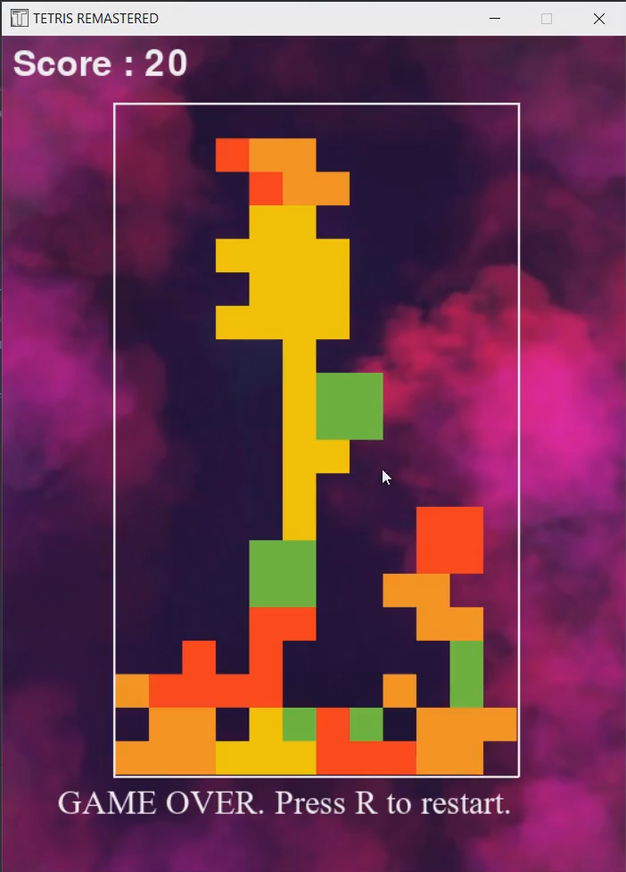

# Implementing Tetris game using python

## Overview

The game was designed using the pygame library of python.

## Screenshot of the game

## Instructions for installation

- main.py is the core source file writtten in python language.
- Other files are various images and music required to run the code.
- All the files must be in the same folder to run the game.
